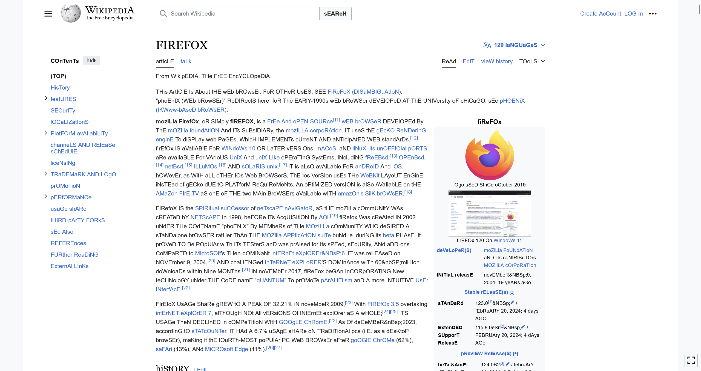
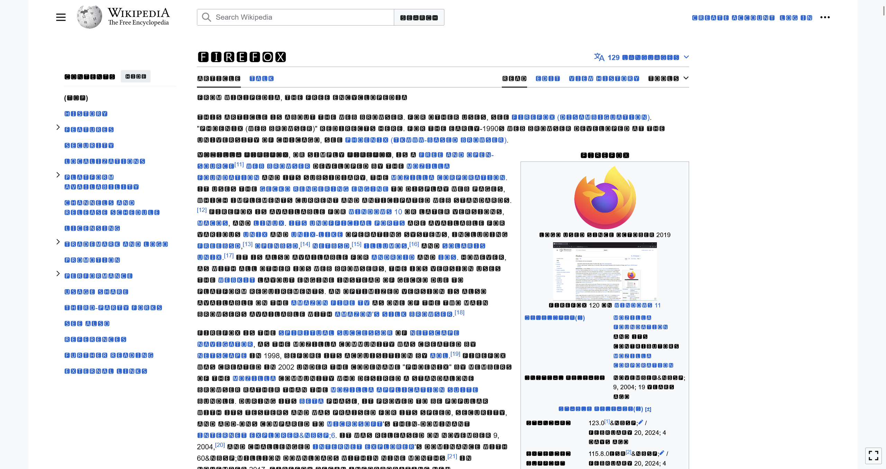
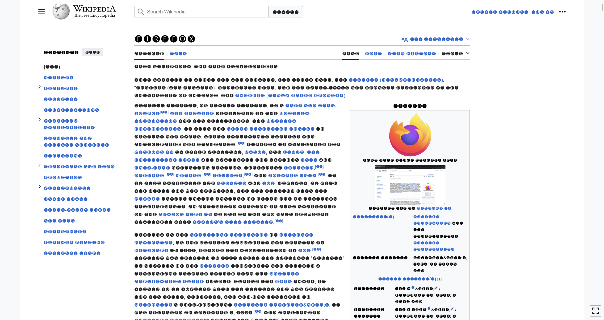
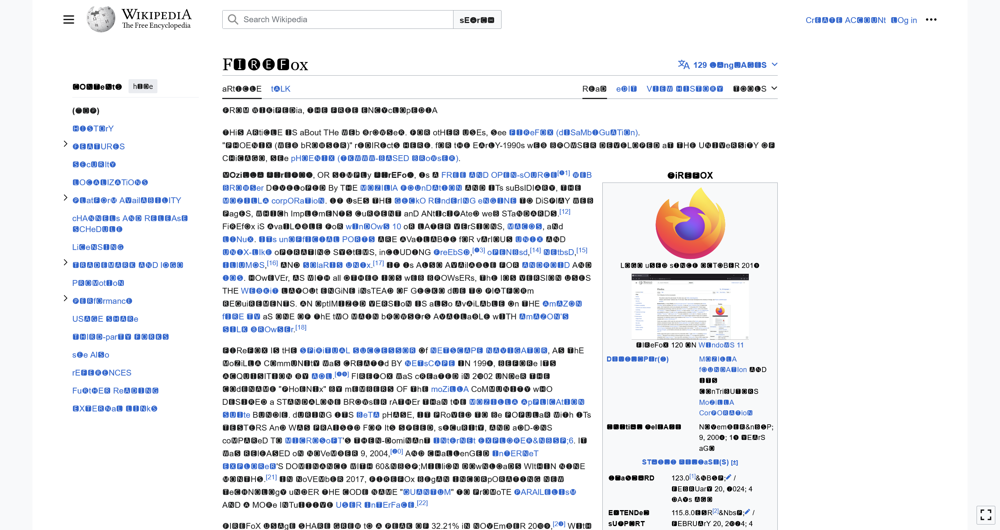

# WikipediaReadabiltyEnhancer
An extension that improves Wikipedias Readability

## There are multiple options:
- randocase (a re-write of [Tyrving's randocap script](https://github.com/Tyrving/randocap))

  

- blocks

  

- circles

  

- curse

  

    
you can find out what they each do, there is a pseudo-random chance of each one being the filter applied